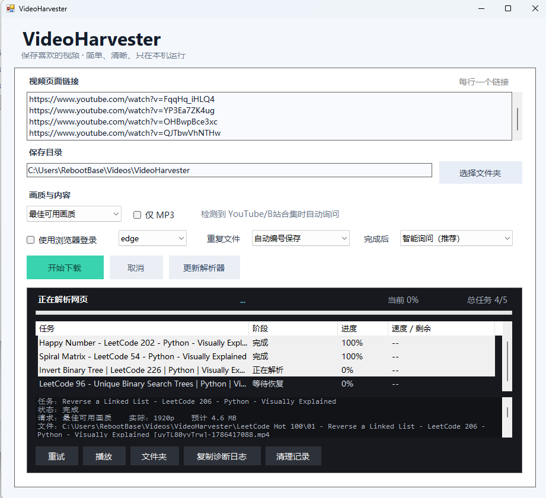
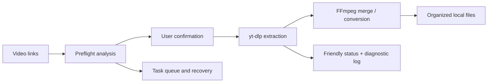

<div align="center">


# VideoHarvester

**A local-first Windows desktop app for saving videos you are authorized to download.**

[](https://github.com/Owl-Lee/VideoHarvester/releases/latest)
[](https://github.com/Owl-Lee/VideoHarvester)
[](https://github.com/Owl-Lee/VideoHarvester/releases/latest)
[](https://github.com/Owl-Lee/VideoHarvester/actions/workflows/build.yml)

[Website](https://video-harvester-pro.liyanbao06.chatgpt.site/) ·
[Download Full](https://github.com/Owl-Lee/VideoHarvester/releases/latest/download/VideoHarvester-v2.0-Full.zip) ·
[Download Lite](https://github.com/Owl-Lee/VideoHarvester/releases/latest/download/VideoHarvester-v2.0-Lite.zip) ·
[中文说明](#中文说明)

</div>



## Overview

VideoHarvester turns public video-page links into an understandable Windows download workflow. Paste one or more links, review what the app detected, choose the quality and destination, and follow every task from preflight analysis to the final file.

The project focuses on the parts that command-line download tools usually leave to the user: playlist decisions, readable progress, duplicate handling, interrupted-task recovery, friendly errors, and predictable file organization.

## Highlights

- **Single videos and batches** — paste multiple links, one per line.
- **Playlist-aware workflow** — detects YouTube playlists and Bilibili collections, then asks whether the whole collection should be downloaded.
- **Preflight confirmation** — shows the detected title, item count, requested/estimated quality, estimated size, login state, disk space, and save location before downloading.
- **Clear task activity** — displays the current stage, percentage, speed, remaining time, and per-item status.
- **Organized collections** — creates a dedicated collection folder and adds numbered filenames automatically.
- **Reliable continuation** — keeps unfinished queues and offers to resume them after the app is reopened.
- **Duplicate protection** — tracks platform video IDs and supports skip, overwrite, or auto-number behavior.
- **Friendly and technical errors** — users see a readable explanation while diagnostic logs remain available for troubleshooting.
- **Optional browser authentication** — reads an existing browser session only when explicitly enabled by the user.
- **Local-first design** — media is processed and saved on the user's computer; VideoHarvester does not upload videos to its own server.

## Download

| Edition | Recommended for | Package |
| --- | --- | --- |
| **Full** | Most users. Includes the required media tools and works out of the box. | [Download Full](https://github.com/Owl-Lee/VideoHarvester/releases/latest/download/VideoHarvester-v2.0-Full.zip) |
| **Lite** | Users who prefer a small package. Required tools are prepared on first use. | [Download Lite](https://github.com/Owl-Lee/VideoHarvester/releases/latest/download/VideoHarvester-v2.0-Lite.zip) |

See the [latest release notes](https://github.com/Owl-Lee/VideoHarvester/releases/latest) for package sizes, checksums, and changes.

## Quick start

1. Download and extract the **Full** edition.
2. Open `VideoHarvester.exe`.
3. Paste one or more public video-page links, one link per line.
4. Select the save folder and preferred quality.
5. Review the preflight summary and confirm the download.
6. Follow progress in the activity panel. When the task finishes, open the file or its folder directly from the app.

> Windows may show a SmartScreen warning because the current executable is not code-signed. Verify that you downloaded it from this repository's official Release page before running it.

## Supported workflows

VideoHarvester is specifically designed and tested around:

- YouTube single videos and playlists
- Bilibili single videos, multi-part videos, and collections
- Video downloads with selectable maximum quality
- MP3 audio extraction
- Multiple independent links in one queue

Other sites supported by the underlying extraction engine may work, but they are not guaranteed. Website changes, regional restrictions, account permissions, or unavailable formats can affect results.

## How it works



## Engineering notes

The desktop client is built with **C# and Windows Forms**. It coordinates several specialized local tools rather than reimplementing platform extraction and media codecs:

- **yt-dlp** handles page extraction and format selection.
- **FFmpeg / ffprobe** handle media merging, conversion, and metadata inspection.
- **Deno** provides the JavaScript runtime required by modern extraction workflows.

VideoHarvester adds a product layer around those tools:

- asynchronous process execution without freezing the interface;
- structured parsing of progress and output events;
- persisted queue, settings, and download history;
- platform-ID-based duplicate detection;
- preflight estimation and disk-space checks;
- human-readable error translation with copyable raw diagnostics;
- collection-aware folder and filename generation.

## Source and development

The repository contains the maintainable C# Windows Forms source, a Visual Studio solution, repeatable PowerShell build scripts, and framework-free core checks that can run on a clean Windows build agent.

```text
src/VideoHarvester.App/          Desktop application and reusable core rules
tests/VideoHarvester.Core.Tests/ Executable core-check suite
scripts/                         Local build and test entry points
docs/                            Architecture and development notes
```

On Windows with the .NET Framework 4.7.2 Developer Pack installed:

```powershell
powershell -ExecutionPolicy Bypass -File .\scripts\test.ps1
```

See [Development](docs/DEVELOPMENT.md) for setup instructions, [Architecture](docs/ARCHITECTURE.md) for the application flow and source map, and the [product case study](docs/CASE_STUDY.md) for the design decisions behind the workflow.

## Privacy and permissions

- Downloads and media processing happen locally.
- VideoHarvester does not run an analytics or tracking service.
- Browser login data is used only when the user enables **Use browser login**.
- The app does not bypass DRM, paywalls, private-video permissions, or membership requirements.
- Users are responsible for following the website's terms and applicable copyright law.

Please download only content that you own, that is in the public domain, or that you otherwise have permission to save.

## Current limitations

- Windows only.
- Availability and maximum quality depend on the source website, region, and account permissions.
- Some authenticated workflows require the selected browser to be closed before its session data can be read.
- Extraction may temporarily break when a supported website changes its page or API behavior; updating the parser usually resolves this.
- The executable is not currently code-signed.

## Roadmap

- Improve accessibility and high-DPI behavior.
- Expand automated UI and integration coverage.
- Add a reproducible release-packaging workflow.
- Add signed Windows releases when practical.

## Acknowledgements

VideoHarvester builds on the work of [yt-dlp](https://github.com/yt-dlp/yt-dlp), [FFmpeg](https://ffmpeg.org/), and [Deno](https://deno.com/). Each bundled third-party component remains subject to its own license.

See [Third-party notices](THIRD_PARTY_NOTICES.md) for source and license links.

---

## 中文说明

VideoHarvester 是一个本地运行的 Windows 视频保存工具，目标是把命令行下载流程变成普通用户也能理解的桌面软件。

### 主要功能

- 支持单个视频、批量链接、YouTube 播放列表和 Bilibili 合集。
- 下载前显示识别结果、任务数量、预计画质、预计大小、磁盘空间和保存位置。
- 显示下载阶段、百分比、速度、剩余时间以及每个任务的状态。
- 合集自动创建独立文件夹并按顺序编号。
- 软件关闭后保留未完成队列，再次打开时可以继续。
- 通过平台视频 ID 判断重复内容，并支持跳过、覆盖和自动编号。
- 普通用户看到易懂的错误说明，同时保留可复制的技术诊断日志。
- 媒体处理均在本机完成，不会上传到 VideoHarvester 自己的服务器。

### 下载版本

- [完整版（推荐）](https://github.com/Owl-Lee/VideoHarvester/releases/latest/download/VideoHarvester-v2.0-Full.zip)：包含必要组件，解压后即可使用。
- [轻量版](https://github.com/Owl-Lee/VideoHarvester/releases/latest/download/VideoHarvester-v2.0-Lite.zip)：体积更小，首次使用时会准备相关组件。

请只保存您拥有、处于公共领域或已经获得授权的内容。本软件不绕过 DRM、付费墙、私密视频或账号权限。
